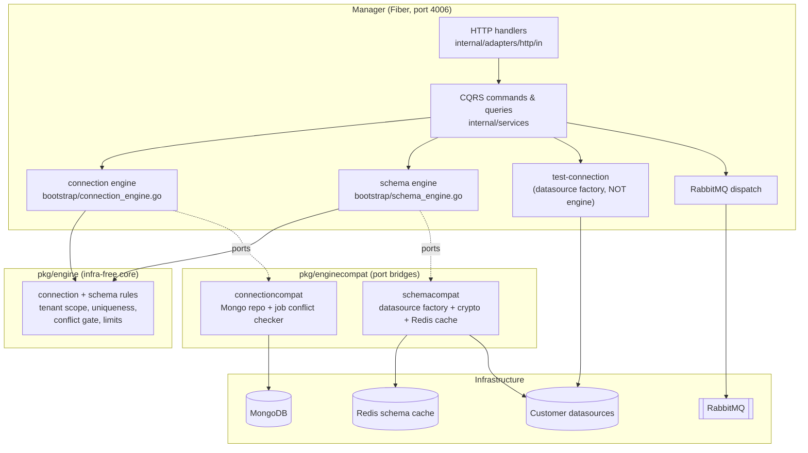
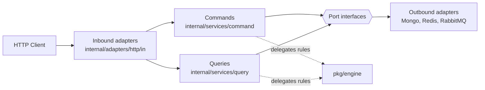
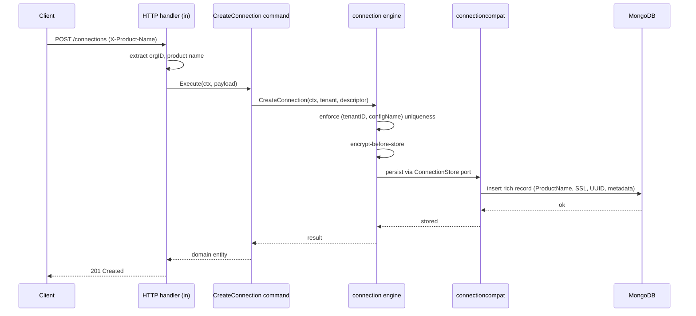

# Manager

The Manager is the Fetcher HTTP API server. It runs the synchronous control plane: connection CRUD, schema discovery and validation, connection testing, idempotency, rate limiting, license enforcement, and job dispatch onto RabbitMQ. The Worker does the actual extraction asynchronously.

The Manager is built on [Fiber](https://gofiber.io) and serves on port `4006`. It follows Hexagonal Architecture with CQRS: commands mutate state, queries read it, and both depend only on port interfaces.

## Table of Contents

- [Overview](#overview)
- [Relationship to the Engine](#relationship-to-the-engine)
- [Architecture](#architecture)
- [Responsibilities](#responsibilities)
- [Request Flow](#request-flow)
- [Readiness and Health](#readiness-and-health)
- [Directory Layout](#directory-layout)
- [Configuration](#configuration)

## Overview

The Manager owns everything the caller touches over HTTP and everything that must hold true *before* a job is queued:

- **Connection lifecycle** — create, read, list, update, and delete datasource connections, scoped per tenant.
- **Schema discovery and validation** — inspect a connection's tables and columns, validate a requested field set against them, and cache results in Redis.
- **Connection testing** — open a live connection to confirm credentials and reachability.
- **Job dispatch** — accept extraction requests, enforce idempotency, and publish them to RabbitMQ for the Worker.
- **Cross-cutting controls** — authentication, license enforcement, rate limiting, and request tracing.

The Manager never performs extraction itself. It validates, persists, and dispatches; the Worker extracts.

## Relationship to the Engine

The Manager no longer carries its own connection or schema *rules*. Those rules — tenant scoping, `(tenantID, configName)` uniqueness, active-job conflict gating, encrypt-before-store, schema discovery and validation, and resource limits — now live in `pkg/engine`, the embedded runtime core.

`pkg/engine` is infrastructure-free. It depends only on host-provided **port interfaces** and is forbidden by a build-enforced test (`pkg/engine/dependency_test.go`) from importing Fiber, RabbitMQ, the Mongo driver, Redis, SQL drivers, AWS S3, SeaweedFS, or even `net/http`. The Manager bridges the engine's ports to its real infrastructure through compatibility adapters in `pkg/enginecompat`.

The Manager wires **two** engine instances, each a focused authority:



### Connection engine

Wired in `internal/bootstrap/connection_engine.go`. This is the authority for the Manager's connection rules. All five connection services (`CreateConnection`, `GetConnection`, `ListConnections`, `UpdateConnection`, `DeleteConnection`) route their tenant-scoped policy through it.

- It is backed by the MongoDB connection repository through `connectioncompat`, with an active-execution conflict checker layered over the job repository.
- The engine enforces `(tenantID, configName)` uniqueness, gates updates and deletes against active jobs, and applies encrypt-before-store.
- The rich Mongo record — `ProductName`, SSL fields, UUID, metadata, timestamps — rides as **opaque host bytes** inside the engine's connection descriptor. No field is dropped, and `ProductName` never becomes an engine scoping dimension.

Because the connection engine never plans or executes extraction, it is wired with a no-op connector registry: the registry port is required by `engine.New`, but this instance never builds a connector.

### Schema engine

Wired in `internal/bootstrap/schema_engine.go`. This is the authority for schema discovery and validation.

- It is backed by the datasource factory plus crypto through `schemacompat`, and a Redis-backed schema cache behind the `engine.SchemaCache` port.
- The Manager resolves the target connection on its own hot path, then seeds it into the request context (`schemacompat.WithResolvedConnections`) so the engine never re-resolves and the tenant manager stays out of the engine core.
- **Schema discovery** (`GET /schema`) is always-fresh: it forces a refresh and bypasses the cache, so callers see the live structure.
- **Schema validation** is cache-first: it reads the cached snapshot when present and discovers fresh only on a miss.

### What stays out of the engine

- **Test-connection is NOT delegated.** It still goes directly through the datasource factory, because it is a liveness probe, not a rule.
- Auth, license enforcement, HTTP shape, rate limiting, idempotency, RabbitMQ job dispatch, and the `/health` + `/readyz` endpoints all stay Manager-owned. Encrypted persistence also stays Manager-side via the rich model's `PasswordEncrypted`; no `CredentialProtector` is wired into either engine.

## Architecture

The Manager follows Hexagonal Architecture with CQRS.



- **Inbound adapters** (`internal/adapters/http/in/`) are thin Fiber handlers with Swagger annotations. They extract the organization ID via `httpUtils.GetOrganizationID(c)` and the product name from the `X-Product-Name` header, then call a service.
- **Commands** (`internal/services/command/`) handle Create, Update, and Delete.
- **Queries** (`internal/services/query/`) handle Get, List, Test, and Validate.
- **Bootstrap** (`internal/bootstrap/`) wires dependencies, including the two engines, and holds configuration.

Every service depends on port interfaces — never on a concrete adapter — so the same service runs against a real Mongo repository in production and a mock in tests.

## Responsibilities

| Concern | Owner |
|---------|-------|
| Connection CRUD rules (uniqueness, conflict gate, encrypt-before-store) | Connection engine |
| Schema discovery and validation rules + limits | Schema engine |
| Schema cache (Redis) | Manager, behind the engine's `SchemaCache` port |
| Connection persistence (MongoDB, rich record) | Manager, via `connectioncompat` |
| Test-connection liveness | Manager, direct datasource factory |
| Authentication | Manager |
| License enforcement | Manager |
| Rate limiting | Manager |
| Idempotency | Manager |
| Job dispatch to RabbitMQ | Manager |
| `/health`, `/readyz` | Manager |

## Request Flow

A connection create request walks the layers like this:



## Readiness and Health

The Manager serves `/readyz` (readiness) and `/health` (liveness).

`/readyz` runs **parallel** dependency checks:

- MongoDB
- RabbitMQ
- Redis schema cache

In multi-tenant mode it additionally checks the multi-tenant Redis, the Tenant Manager, and exposes a per-tenant readiness endpoint at `/readyz/tenant/:id`.

License enforcement is **fail-closed**: when `DEPLOYMENT_MODE` is not `local`, the Manager refuses to operate without a valid license (see `config.go`). When `DEPLOYMENT_MODE=saas`, `ValidateSaaSTLS()` runs at startup *before any platform connection opens*, so the process never reaches the network without verified TLS.

## Directory Layout

| Path | Contents |
|------|----------|
| `cmd/app/main.go` | Entry point |
| `internal/adapters/http/in/` | Fiber HTTP handlers (with Swagger annotations) |
| `internal/services/command/` | CQRS commands (Create, Update, Delete) |
| `internal/services/query/` | CQRS queries (Get, List, Test, Validate) |
| `internal/adapters/cache/` | Redis schema cache adapter |
| `internal/bootstrap/` | Dependency injection, config, and engine wiring |
| `internal/bootstrap/connection_engine.go` | Connection engine wiring |
| `internal/bootstrap/schema_engine.go` | Schema engine wiring |
| `api/swagger.yaml` | OpenAPI specification |
| `api/requests.http` | Manual API request examples |

## Configuration

The Manager requires `APP_ENC_KEY` in `components/manager/.env` before it will start. Generate it with:

```bash
make generate-master-key
```

`DEPLOYMENT_MODE` controls license and TLS behavior:

| Mode | License | TLS |
|------|---------|-----|
| `local` | Not enforced | Not validated at startup |
| `saas` | Enforced (fail-closed) | `ValidateSaaSTLS()` runs before any platform connection |
| other non-`local` | Enforced (fail-closed) | — |

See `internal/bootstrap/config.go` for the full configuration surface and `../../README.md` for the project-wide quick start.
