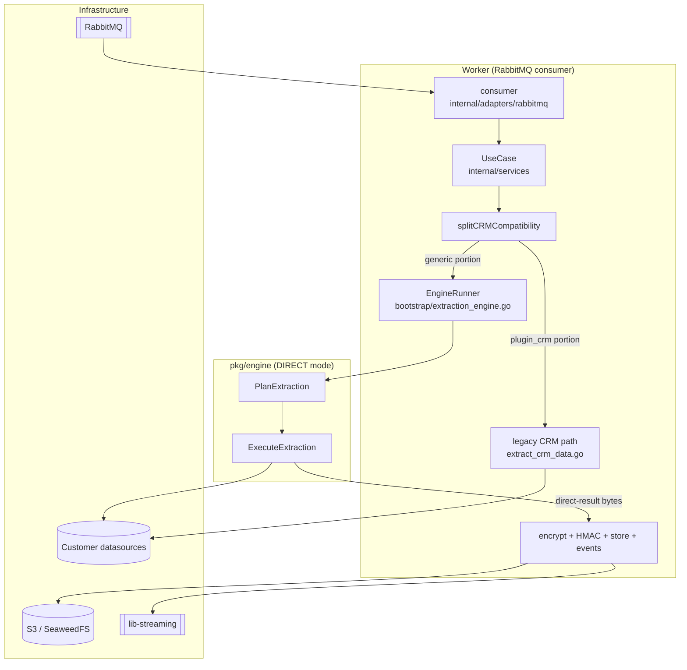
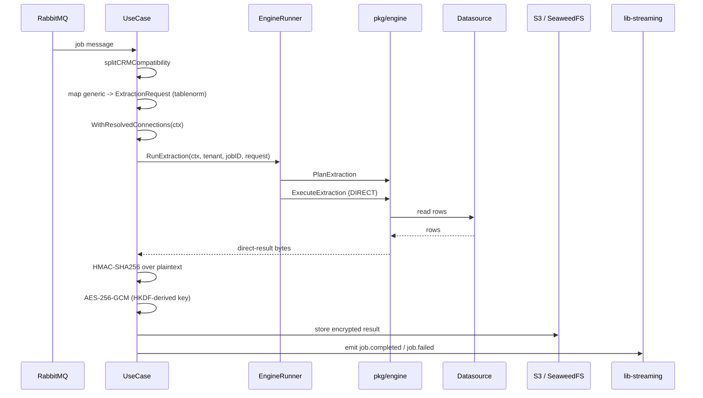

# Worker

The Worker is the Fetcher asynchronous data plane. It consumes extraction jobs from RabbitMQ, runs the extraction through the embedded runtime engine, then encrypts, signs, stores, and announces the result. The Manager queues the work; the Worker does it.

Unlike the Manager, the Worker does **not** use CQRS. It runs a single `UseCase` struct in `internal/services/`, driven by a RabbitMQ consumer in `internal/adapters/rabbitmq/`.

## Table of Contents

- [Overview](#overview)
- [Relationship to the Engine](#relationship-to-the-engine)
- [Extraction Flow](#extraction-flow)
- [The CRM Exception](#the-crm-exception)
- [What the Worker Owns](#what-the-worker-owns)
- [Readiness and Startup Gates](#readiness-and-startup-gates)
- [Directory Layout](#directory-layout)

## Overview

The Worker turns a queued job into a stored, signed, encrypted result:

1. Consume a job message from RabbitMQ.
2. Resolve the job's connections.
3. Run the generic extraction through the embedded engine.
4. Compute an HMAC over the plaintext, encrypt it, and store it to object storage.
5. Emit a `job.completed` or `job.failed` event.

The engine produces the rows. Everything around the rows — credentials, encryption, storage, job status, and event notifications — is the Worker's job and stays entirely outside the engine.

## Relationship to the Engine

The legacy direct-to-datasource extraction path has been **removed**. The engine runner is now **mandatory**.

`pkg/engine` is the infrastructure-free extraction core. It owns the rules of planning and execution — schema validation, query planning, limits, and the result/error contracts — and depends only on host-provided **port interfaces**. A build-enforced test (`pkg/engine/dependency_test.go`) forbids it from importing RabbitMQ, the Mongo driver, Redis, SQL drivers, AWS S3, SeaweedFS, Fiber, or `net/http`. The Worker bridges those ports to real infrastructure through `pkg/enginecompat`.

The runner is wired in `internal/bootstrap/extraction_engine.go` during `InitWorker`. A **nil runner is a startup-fatal wiring error**, validated through `service.Validate()` — not a runtime nil panic. If the engine fails to wire, the Worker refuses to start.

The Worker's engine instance is deliberately minimal. It is wired with only:

- a **connector registry** (the `enginecompat/datasource` connector factory), and
- a **connection store** (the request-scoped `schemacompat` store).

There is **no** `ResultSink`, `ExecutionStore`, or `EventSink`. Extraction runs in **DIRECT mode**: the engine returns the result bytes inline and the Worker owns everything after that.



## Extraction Flow

The generic extraction path lives in `internal/services/extract_engine.go`.

1. **Split the job.** `splitCRMCompatibility` divides the job into a CRM portion and a generic portion. CRM is handled separately (see below); the generic portion goes to the engine.
2. **Map the request.** The generic portion is mapped to an `engine.ExtractionRequest`. Table and field key normalization happens via `tablenorm`.
3. **Seed connections.** The resolved connections are placed into the request context with `schemacompat.WithResolvedConnections`, so the engine's connection store reads them without re-resolving — the tenant manager stays out of the engine core.
4. **Plan, then execute.** `EngineRunner.RunExtraction` calls `engine.PlanExtraction` (strict schema validation against the host-normalized snapshot), then `engine.ExecuteExtraction` in DIRECT mode. The plan's mode is left `ModeAuto`, which resolves to DIRECT because no `ResultSink` is configured.
5. **Finalize.** The engine returns direct-result bytes. The Worker takes over from here.



## The CRM Exception

`plugin_crm` extraction is the documented exception: it does **not** route through the engine.

CRM extraction needs collection-prefix fan-out, search-field filter hashing, and PII field decryption — product policy the engine core stays deliberately agnostic of. It runs through the legacy `internal/services/extract_crm_data.go` path. A CRM-only job never calls the engine at all.

When a job mixes CRM and generic work, `splitCRMCompatibility` separates the two: the CRM portion takes the legacy path and the generic portion takes the engine path.

## What the Worker Owns

The engine returns rows; the Worker owns the entire envelope around them.

| Concern | Detail |
|---------|--------|
| Integrity | HMAC-SHA256 computed over the **plaintext** result |
| Encryption | AES-256-GCM with an HKDF-derived key |
| Storage | Encrypted result written to S3 / SeaweedFS |
| Job lifecycle | Status transitions managed by the Worker, not the engine |
| Events | `job.completed` / `job.failed` via lib-streaming |
| CRM extraction | Legacy path, outside the engine |

The order matters: HMAC over plaintext first, then encrypt, then store. This keeps the integrity check independent of the storage layer.

The serialized result artifact is bounded by the engine's `MaxResultBytes` ceiling (default 256 MiB). Because the stored result JSON is indented, the effective ceiling is tighter than the raw row payload. Set `ENGINE_MAX_RESULT_BYTES` (a plain integer byte count) to override it operationally — unset, `0`, or negative keeps the 256 MiB default; a positive value overrides only `MaxResultBytes`, leaving every other engine limit at its default.

## Job Event Delivery

Terminal job events (`job.completed` / `job.failed`) are delivered **at-least-once** through a durable outbox plus a terminal-event repairer. If a job marks its terminal-event-pending flag and then crashes — or fails to clear the flag — the repairer re-emits the event on recovery, and lib-streaming allocates a fresh outbox row per emit. The broker therefore may see the same event more than once.

The dedup anchor is the CloudEvents id, which is deterministic and stable across re-emits:

```
ce-id = fetcher.job.<status>.<jobID>
```

**Subscribers MUST be idempotent, keyed on `ce-id`.** Do not rely on the outbox row id (it changes per emit) or on exactly-once delivery at the broker. The job's `source` is carried in the event payload metadata, **not** in the RabbitMQ routing key — the routing key uses stable event keys (`job.completed` / `job.failed`).

## Readiness and Startup Gates

The Worker serves `/readyz` like the Manager, and adds an **S3 `HeadBucket`** check to confirm object storage is reachable.

The Worker fails closed on two conditions at startup:

- **Engine runner not wired** — `service.Validate()` rejects a nil runner, so a broken engine wiring stops the process before it consumes any job.
- **lib-streaming disabled** — the Worker requires lib-streaming to be enabled, because `job.completed` / `job.failed` notifications are mandatory. Without it, the process refuses to start.

## Directory Layout

| Path | Contents |
|------|----------|
| `cmd/app/main.go` | Entry point |
| `internal/adapters/rabbitmq/` | RabbitMQ consumer |
| `internal/services/` | The single `UseCase` struct (no CQRS) |
| `internal/services/extract_engine.go` | Generic engine-backed extraction flow |
| `internal/services/extract_crm_data.go` | Legacy CRM extraction path (engine exception) |
| `internal/bootstrap/extraction_engine.go` | Engine runner wiring (mandatory) |

See `../../README.md` for the project-wide quick start, and `../manager/README.md` for the control plane that queues the jobs this Worker consumes.
