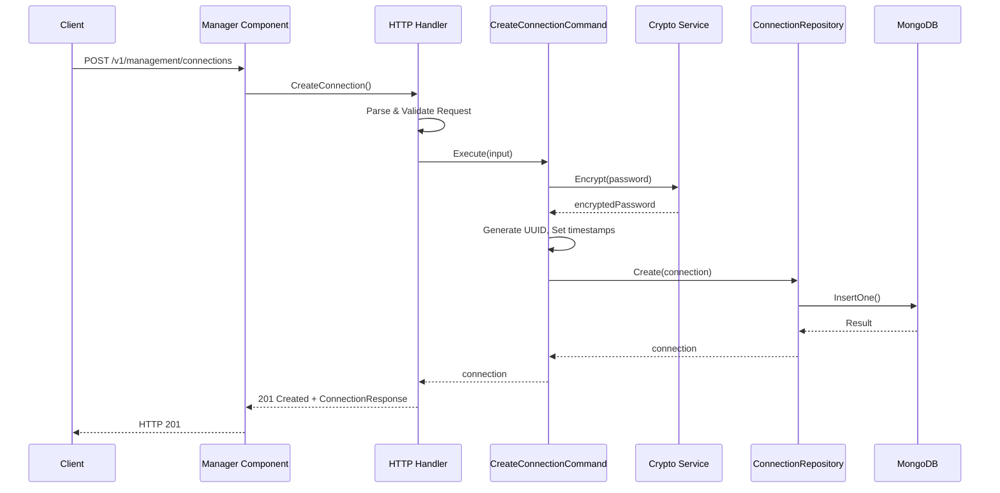
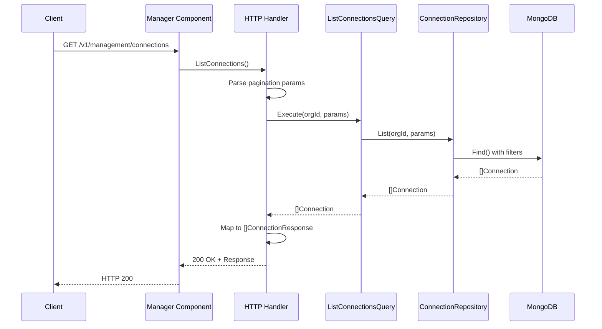
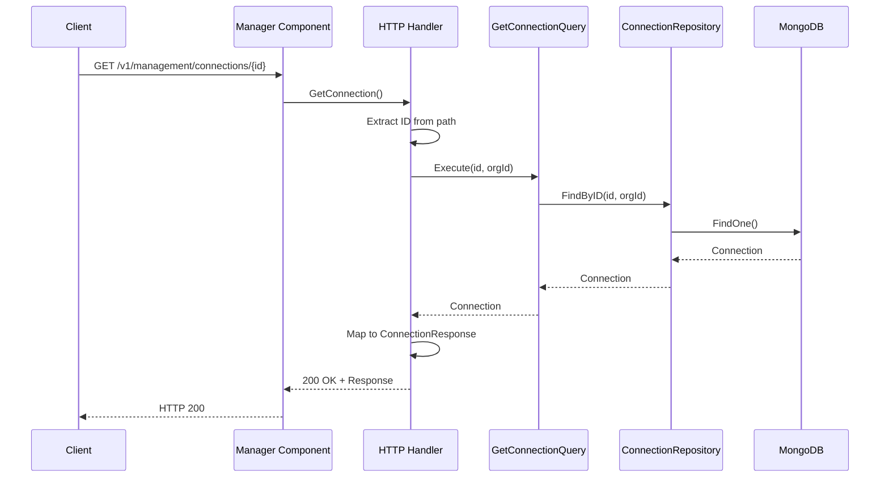
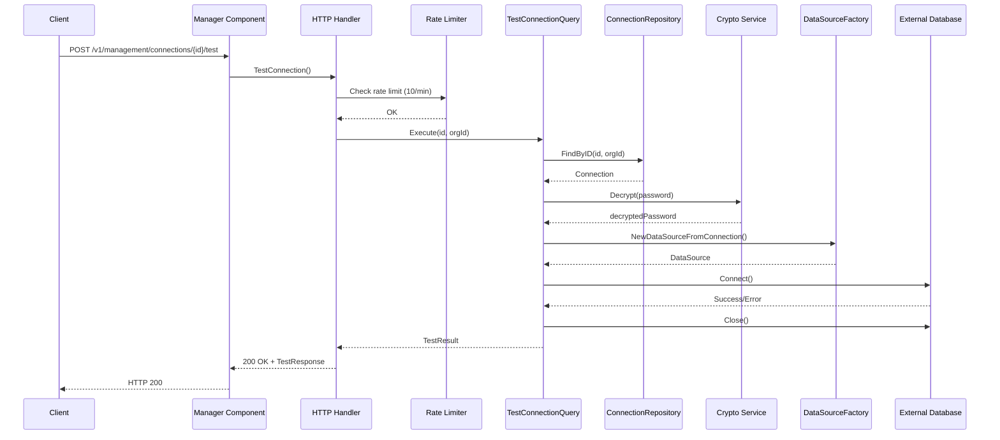
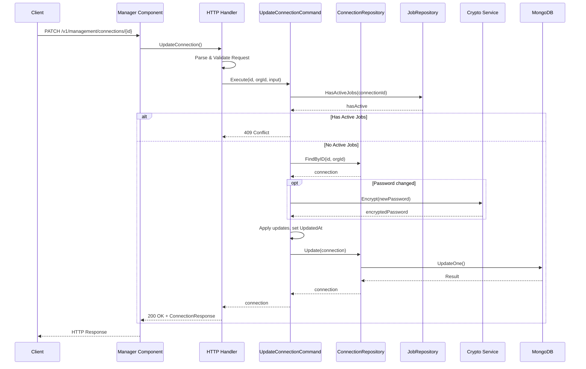
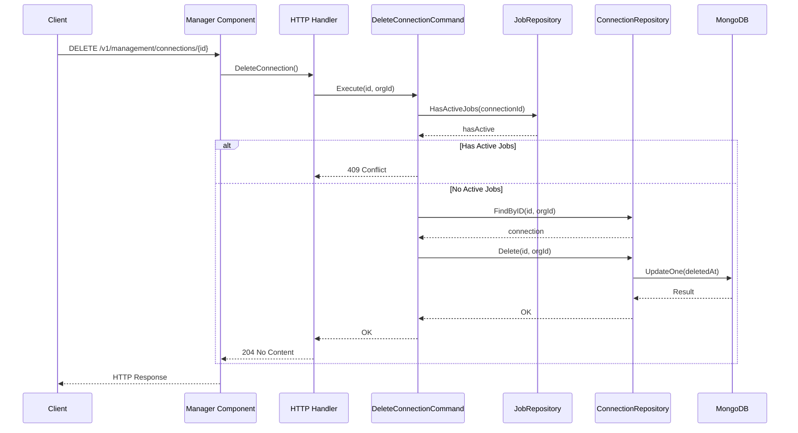
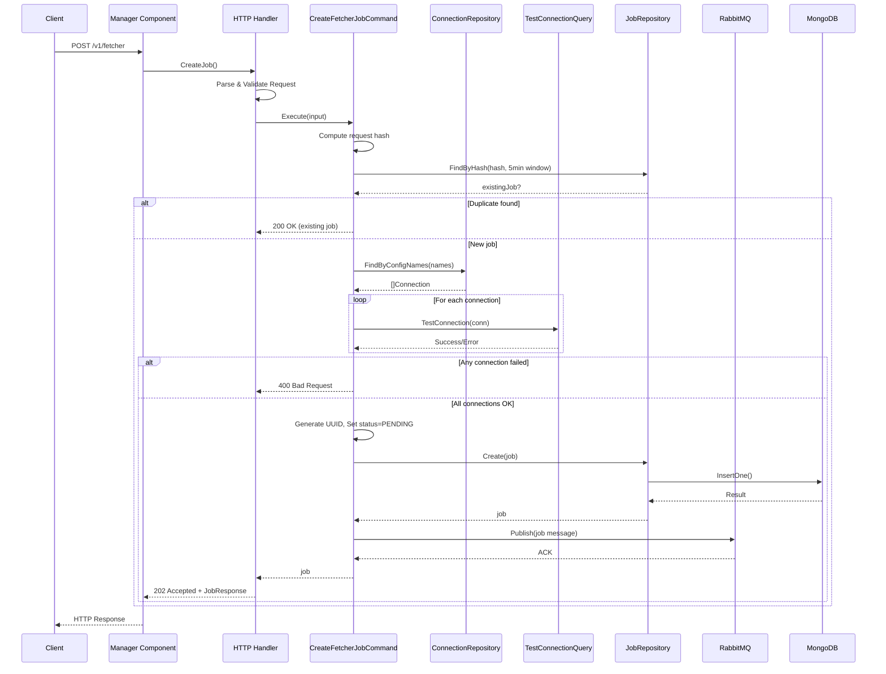
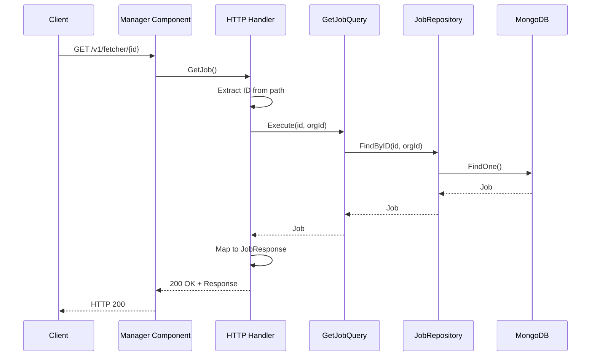
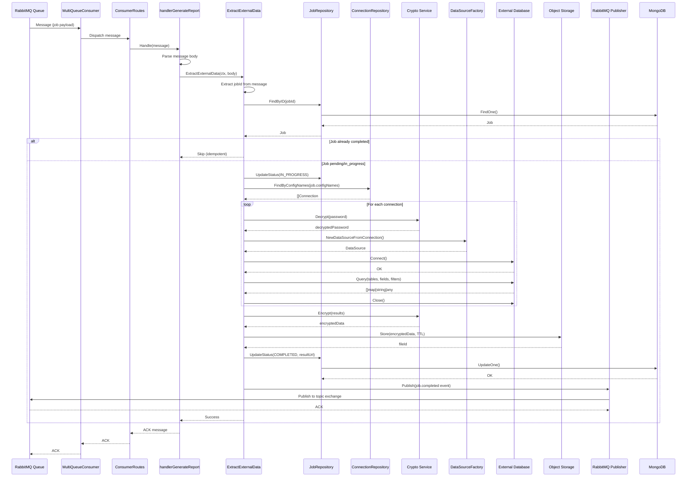

# Architecture Documentation - Fetcher

## Overview

Fetcher is a **data extraction microservices system** built with Go following **Hexagonal Architecture** and **CQRS (Command Query Responsibility Segregation)** patterns. The system extracts data from multiple external databases, encrypts the results, and stores them in a distributed file system.

### Technology Stack

| Category | Technology | Version |
|----------|------------|---------|
| **Language** | Go | 1.25.6 |
| **Web Framework** | Fiber | v2.52.10 |
| **Message Queue** | RabbitMQ | v1.10.0 |
| **Primary Database** | MongoDB | Latest |
| **File Storage** | SeaweedFS (default) / S3-compatible | SeaweedFS 3.97 / AWS SDK v2 |
| **Observability** | OpenTelemetry | v1.39.0 |
| **API Documentation** | Swagger/Swaggo | v1.16.6 |

### Supported External Databases

- MongoDB
- PostgreSQL
- MySQL
- Oracle
- SQL Server

---

## Project Structure

```
fetcher/
├── components/                    # Independent service components
│   ├── infra/                     # Infrastructure services (Docker Compose)
│   ├── manager/                   # HTTP API server
│   └── worker/                    # Async job processor
├── pkg/                           # Shared packages
│   ├── model/                     # Domain models (entities, DTOs)
│   ├── mongodb/                   # MongoDB repositories (connection, job)
│   ├── postgres/                  # PostgreSQL adapter
│   ├── mysql/                     # MySQL adapter
│   ├── oracle/                    # Oracle adapter
│   ├── sqlserver/                 # SQL Server adapter
│   ├── rabbitmq/                  # RabbitMQ adapter
│   ├── seaweedfs/                 # SeaweedFS client
│   ├── storage/                   # Storage factory (SeaweedFS / S3 abstraction)
│   ├── crypto/                    # Encryption service
│   ├── datasource/                # DataSource factory + SSL mode utils
│   ├── redis/                     # Redis/Valkey client adapter
│   ├── ratelimit/                 # Rate limiter (Redis-backed)
│   ├── metrics/                   # Multi-tenant OTel metrics (no-op when disabled)
│   ├── multitenant/               # Multi-tenant cross-cutting test suite
│   ├── net/http/                  # HTTP utilities
│   └── constant/                  # Application constants
├── tests/                         # Test infrastructure and integration tests
│   ├── shared/                    # Shared test infrastructure library
│   │   ├── config/                # Configuration, ports, timeouts
│   │   ├── client/                # API clients (Manager, RabbitMQ, SeaweedFS)
│   │   ├── containers/            # Docker container orchestration
│   │   ├── network/               # Docker network management
│   │   ├── fixtures/              # Database init scripts (embedded SQL)
│   │   └── topology/              # RabbitMQ exchange/queue setup
│   └── integration/               # Integration tests
│       └── containers/            # End-to-end container tests
├── scripts/                       # Build and validation scripts
├── .github/                       # CI/CD workflows
└── .githooks/                     # Git hooks for code quality
```

---

## Components

### 1. Infra Component

**Location:** `components/infra/`

**Purpose:** Infrastructure provisioning via Docker Compose. Not a Go application - purely configuration.

**Services Provided:**

| Service | Image | Purpose | Ports |
|---------|-------|---------|-------|
| `fetcher-mongodb` | `mongo:latest` | Primary data store | Variable |
| `fetcher-rabbitmq` | `rabbitmq:4.0-management-alpine` | Message broker | AMQP + Management UI |
| `fetcher-seaweedfs-master` | `chrislusf/seaweedfs:3.97` | Distributed file storage (master) | 9335, 9336 |
| `fetcher-seaweedfs-volume` | `chrislusf/seaweedfs:3.97` | Distributed file storage (volume) | 9081 |
| `fetcher-seaweedfs-filer` | `chrislusf/seaweedfs:3.97` | Distributed file storage (filer) | 8889, 8334 |
| `fetcher-keda` | `ghcr.io/kedacore/keda:2.16.0` | Kubernetes event-driven autoscaler | 8000 |

**RabbitMQ Topology:**

| Type | Name | Purpose |
|------|------|---------|
| **Queue** | `fetcher.extract-external-data.queue` | Main job processing (with DLQ support) |
| **Queue** | `fetcher.dlq` | Dead letter queue (7-day TTL, max 10,000 messages) |
| **Exchange** | `fetcher.extract-external-data.exchange` | Direct exchange for job routing |
| **Exchange** | `fetcher.dlx` | Dead letter exchange |
| **Exchange** | `fetcher.job.events` | Topic exchange for job notifications |

---

### 2. Manager Component

**Location:** `components/manager/`

**Purpose:** HTTP API server that handles connection management and job orchestration.

**Responsibilities:**
- Manage database connection configurations
- Create and track data extraction jobs
- Validate connections before job execution
- Publish jobs to RabbitMQ for async processing

**Entry Point:** `components/manager/cmd/app/main.go`

#### Internal Structure (Hexagonal Architecture)

```
components/manager/
├── cmd/app/
│   └── main.go                     # Application entry point
├── api/
│   └── docs.go                     # Swagger documentation
└── internal/
    ├── adapters/
    │   └── http/in/
    │       ├── routes.go           # HTTP route definitions (Primary Adapter). Accepts optional tenantMiddleware for multi-tenant DB resolution.
    │       ├── middlewares.go      # HTTP middleware
    │       ├── connection.go       # Connection HTTP handlers
    │       ├── fetcher.go          # Fetcher job HTTP handlers
    │       ├── migration.go        # Migration HTTP handlers (assign/unassigned)
    │       └── swagger.go          # Swagger configuration
    ├── adapters/
    │   └── cache/
    │       ├── schema_cache_interface.go  # SchemaCacheRepository interface
    │       └── schema_cache.go           # Redis-backed schema cache implementation
    ├── bootstrap/
    │   ├── config.go               # Dependency injection
    │   ├── server.go               # HTTP server wrapper
    │   └── service.go              # Application service wrapper
    └── services/
        ├── command/                # CQRS Commands (Write operations)
        │   ├── create_connection.go
        │   ├── update_connection.go
        │   ├── delete_connection.go
        │   ├── create_fetcher_job.go
        │   └── assign_connection.go
        └── query/                  # CQRS Queries (Read operations)
            ├── get_connection.go
            ├── list_connections.go
            ├── test_connection.go
            ├── get_job.go
            ├── get_connection_schema.go
            ├── validate_schema.go
            └── list_unassigned_connections.go
```

#### API Endpoints

##### Connections (Tag: `Connections`)

| Method | Endpoint | Handler | Description |
|--------|----------|---------|-------------|
| `POST` | `/v1/management/connections` | `CreateConnection` | Create new database connection (requires `X-Product-Name` header, encrypted password) |
| `GET` | `/v1/management/connections` | `ListConnections` | List connections with pagination/filters (optional `X-Product-Name` header to filter by product) |
| `POST` | `/v1/management/connections/validate-schema` | `ValidateSchema` | Validate tables/fields against datasources (200 OK / 422 on failure) |
| `GET` | `/v1/management/connections/{id}` | `GetConnection` | Get connection details by ID |
| `POST` | `/v1/management/connections/{id}/test` | `TestConnection` | Test connection (rate-limited: 10/min) |
| `GET` | `/v1/management/connections/{id}/schema` | `GetConnectionSchema` | Retrieve database schema for a connection |
| `PATCH` | `/v1/management/connections/{id}` | `UpdateConnection` | Partial update (409 if active jobs) |
| `DELETE` | `/v1/management/connections/{id}` | `DeleteConnection` | Soft delete (409 if active jobs) |

##### Migration (Tag: `Migration`)

| Method | Endpoint | Handler | Description |
|--------|----------|---------|-------------|
| `GET` | `/v1/management/connections/unassigned` | `ListUnassignedConnections` | List connections not assigned to any product |
| `POST` | `/v1/management/connections/{id}/assign` | `AssignConnectionToProduct` | Assign connection to a product (one-time, irreversible, requires `X-Product-Name` header) |

##### Fetcher Jobs (Tag: `Fetcher`)

| Method | Endpoint | Handler | Description |
|--------|----------|---------|-------------|
| `POST` | `/v1/fetcher` | `CreateJob` | Create data extraction job (202 Accepted / 200 if duplicate) |
| `GET` | `/v1/fetcher/{id}` | `GetJob` | Get job status and details |

##### System

| Method | Endpoint | Description |
|--------|----------|-------------|
| `GET` | `/health` | Health check |
| `GET` | `/version` | Version info |
| `GET` | `/swagger/*` | Swagger UI |

---

### 3. Worker Component

**Location:** `components/worker/`

**Purpose:** Asynchronous job processor that extracts data from external databases.

**Responsibilities:**
- Consume jobs from RabbitMQ queue
- Extract data from configured external databases
- Encrypt and store results in configurable object storage (SeaweedFS or S3-compatible)
- Publish job completion/failure notifications

**Important:** This component has **NO HTTP routes** - it operates purely as a message consumer.

**Entry Point:** `components/worker/cmd/app/main.go`

#### Internal Structure

```
components/worker/
├── cmd/app/
│   └── main.go                      # Application entry point
└── internal/
    ├── adapters/
    │   └── rabbitmq/
    │       ├── consumer.rabbitmq.go # RabbitMQ consumer adapter (Primary Adapter)
    │       └── publisher.rabbitmq.go # RabbitMQ publisher adapter (Secondary Adapter)
    ├── bootstrap/
    │   ├── config.go                # Dependency injection
    │   ├── service.go               # Application service wrapper
    │   └── consumer.go              # Multi-queue consumer orchestration with tenant ID extraction from AMQP headers and tenant MongoDB resolution
    └── services/
        ├── service.go               # UseCase struct definition
        ├── extract-data.go          # Main data extraction logic
        ├── extract_crm_data.go      # Plugin CRM specific extraction
        └── job_notification.go      # Job event notification publishing
```

---

## Packages (pkg/)

### Root Package (`pkg/`)

| File | Purpose |
|------|---------|
| `context.go` | Context utilities and propagation |
| `errors.go` | Custom error types and handling |
| `os.go` | OS-level utilities |
| `utils.go` | General utility functions |
| `time_utils.go` | Time manipulation utilities |

### constant (`pkg/constant/`)

Application-wide constants.

| File | Purpose |
|------|---------|
| `app.go` | Application constants (includes `ApplicationName`, `ModuleManager`, `ModuleWorker` for multi-tenant service identification) |
| `errors.go` | Error code constants |
| `mongo.go` | MongoDB-specific constants |
| `pagination.go` | Pagination defaults |
| `datasource-config.go` | DataSource type constants |
| `seaweedfs.go` | SeaweedFS configuration constants |

### model (`pkg/model/`)

Domain models including entities, DTOs, requests, and responses.

| File | Purpose |
|------|---------|
| `connection.go` | Connection domain entity + DTOs (ConnectionInput, ConnectionUpdateInput, ConnectionResponse). Includes `ProductName` field for product isolation. |
| `job.go` | Job domain entity + DTOs (FetcherRequest, FetcherResponse, JobResponse, JobStatus enum) |
| `schema.go` | Schema validation models (SchemaValidationRequest, SchemaValidationResponse, DataSourceSchema) |
| `pagination.go` | Pagination models and utilities |

**Subpackages:**

- `model/job/` - Job queue message types (`job_queue.go`)
- `model/datasource/` - DataSource interface and configurations for each database type

### mongodb (`pkg/mongodb/`)

MongoDB connection and repository implementations.

| File | Purpose |
|------|---------|
| `mongo.go` | MongoDB connection management |
| `tenant.go` | Shared tenant-aware database resolution (ResolveDatabase) |

**Subpackages:**

- `mongodb/connection/` - Connection repository
  - `connection.go` - MongoDB model mapping
  - `connection.mongodb.go` - Repository implementation (CRUD operations)
  - `indexes.go` - Index definitions

- `mongodb/job/` - Job repository
  - `job.go` - MongoDB model mapping
  - `job.mongodb.go` - Repository implementation (CRUD operations)
  - `indexes.go` - Index definitions

### redis (`pkg/redis/`)

Redis/Valkey client adapter used for rate limiting and schema caching.

| File | Purpose |
|------|---------|
| `redis.go` | Redis connection management and client wrapper |

### ratelimit (`pkg/ratelimit/`)

Rate limiter implementation backed by Redis.

| File | Purpose |
|------|---------|
| `ratelimit.go` | Token-bucket rate limiter using Redis store |

### datasource/sslmode (`pkg/datasource/sslmode/`)

SSL mode configuration utilities for database connections.

| File | Purpose |
|------|---------|
| `sslmode.go` | SSL mode validation and injection for datasource configs |

### Database Adapters

Each database type has its own package implementing the DataSource interface:

| Package | Files | Purpose |
|---------|-------|---------|
| `postgres/` | `postgres.go`, `datasource.postgres.go` | PostgreSQL connection and data extraction |
| `mysql/` | `mysql.go`, `datasource.mysql.go` | MySQL connection and data extraction |
| `oracle/` | `oracle.go`, `datasource.oracle.go` | Oracle connection and data extraction |
| `sqlserver/` | `sqlserver.go`, `datasource.sqlserver.go` | SQL Server connection and data extraction |

### datasource (`pkg/datasource/`)

DataSource factory that creates the appropriate database adapter based on connection type.

| File | Purpose |
|------|---------|
| `datasource-factory.go` | Factory pattern implementation |

```go
func NewDataSourceFromConnection(ctx context.Context, conn *model.Connection, cryptor crypto.Cryptor, logger log.Logger) (datasource.DataSource, error) {
    switch conn.Type {
    case model.TypeMongoDB:     return newDataSourceConfigMongoDB(...)
    case model.TypePostgreSQL:  return newDataSourceConfigPostgres(...)
    case model.TypeOracle:      return newDataSourceConfigOracle(...)
    case model.TypeMySQL:       return newDataSourceConfigMySQL(...)
    case model.TypeSQLServer:   return newDataSourceConfigSQLServer(...)
    }
}
```

### rabbitmq (`pkg/rabbitmq/`)

Resilient RabbitMQ adapter with connection management and message publishing.

| File | Purpose |
|------|---------|
| `rabbitmq.go` | RabbitMQ connection, channel management, publishing |

### storage (`pkg/storage/`)

Provider-agnostic storage factory that selects between SeaweedFS and S3-compatible backends at startup.

| File | Purpose |
|------|---------|
| `factory.go` | `NewRepository()` factory — selects backend from `STORAGE_PROVIDER` env var (`"seaweedfs"` or `"s3"`) |
| `s3.go` | `S3Repository` — AWS SDK v2 implementation; supports AWS S3, MinIO, SeaweedFS S3, and any S3-compatible service |

SSL for S3 is controlled by the URL scheme of `OBJECT_STORAGE_ENDPOINT` (`http://` → no SSL, `https://` → SSL). The factory defaults to SeaweedFS when `STORAGE_PROVIDER` is empty.

### seaweedfs (`pkg/seaweedfs/`)

SeaweedFS HTTP client. Used directly by `pkg/storage` when `STORAGE_PROVIDER=seaweedfs`.

| File | Purpose |
|------|---------|
| `seaweedfs.go` | SeaweedFS HTTP client operations |
| `external/external-data.go` | `SimpleRepository` — implements `storage.Repository` against SeaweedFS Filer |

### crypto (`pkg/crypto/`)

Encryption service using AES-GCM.

| File | Purpose |
|------|---------|
| `crypto.go` | AES-GCM encryption/decryption service |

### net/http (`pkg/net/http/`)

HTTP utilities for the Fiber framework.

| File | Purpose |
|------|---------|
| `errors.go` | HTTP error handling and responses |
| `response.go` | Standard response formatting |
| `cursor.go` | Cursor-based pagination utilities |
| `withBody.go` | Request body handling |
| `http-utils.go` | General HTTP utilities |

### metrics (`pkg/metrics/`)

Multi-tenant metrics instrumentation using OpenTelemetry.

| File | Purpose |
|------|---------|
| `tenant_metrics.go` | 4 canonical tenant metrics with no-op when disabled |

### multitenant (`pkg/multitenant/`)

Cross-cutting multi-tenant test suite (test-only package).

| File | Purpose |
|------|---------|
| `multitenant_test.go` | Tenant isolation, backward compatibility, and context propagation tests |

---

## Architecture Layers

### Hexagonal Architecture

The project follows hexagonal architecture (ports and adapters):

```
                    ┌─────────────────────────────────────────┐
                    │              PRIMARY ADAPTERS           │
                    │         (Inbound - Driving Side)        │
                    │                                         │
                    │  ┌─────────────┐    ┌─────────────────┐ │
                    │  │ HTTP/Fiber  │    │ RabbitMQ        │ │
                    │  │ (Manager)   │    │ Consumer        │ │
                    │  │             │    │ (Worker)        │ │
                    │  └──────┬──────┘    └────────┬────────┘ │
                    └─────────┼───────────────────┼───────────┘
                              │                    │
                              ▼                    ▼
┌─────────────────────────────────────────────────────────────────────────┐
│                         APPLICATION CORE                                │
│                                                                         │
│  ┌────────────────────────────────────────────────────────────────────┐ │
│  │                    APPLICATION SERVICES                            │ │
│  │                                                                    │ │
│  │   ┌─────────────────────┐      ┌─────────────────────┐             │ │
│  │   │      COMMANDS       │      │       QUERIES       │             │ │
│  │   │  (Write Operations) │      │  (Read Operations)  │             │ │
│  │   │                     │      │                     │             │ │
│  │   │ - CreateConnection  │      │ - GetConnection     │             │ │
│  │   │ - UpdateConnection  │      │ - ListConnections   │             │ │
│  │   │ - DeleteConnection  │      │ - TestConnection    │             │ │
│  │   │ - CreateFetcherJob  │      │ - GetJob            │             │ │
│  │   │ - AssignConnection  │      │ - ListUnassigned    │             │ │
│  │   │                     │      │                     │             │ │
│  │   └─────────────────────┘      └─────────────────────┘             │ │
│  └────────────────────────────────────────────────────────────────────┘ │
│                                                                         │
│  ┌────────────────────────────────────────────────────────────────────┐ │
│  │                         DOMAIN                                     │ │
│  │                                                                    │ │
│  │   ┌─────────────┐    ┌─────────────┐                              │ │
│  │   │ Connection  │    │    Job      │                              │ │
│  │   │   Entity    │    │   Entity    │                              │ │
│  │   └─────────────┘    └─────────────┘                              │ │
│  │   ┌─────────────┐                                                 │ │
│  │   │ DataSource  │                                                 │ │
│  │   │  Interface  │                                                 │ │
│  │   └─────────────┘                                                 │ │
│  └────────────────────────────────────────────────────────────────────┘ │
│                                                                         │
│  ┌────────────────────────────────────────────────────────────────────┐ │
│  │                     PORTS (Interfaces)                             │ │
│  │                                                                    │ │
│  │   - ConnectionRepository    - RabbitMQ Publisher                   │ │
│  │   - JobRepository           - Storage Repository                    │ │
│  │   - SchemaCacheRepository   - Cryptor                              │ │
│  │   - DataSource                                                     │ │
│  └────────────────────────────────────────────────────────────────────┘ │
└─────────────────────────────────────────────────────────────────────────┘
                              │                    │
                              ▼                    ▼
                    ┌─────────────────────────────────────────┐
                    │            SECONDARY ADAPTERS           │
                    │        (Outbound - Driven Side)         │
                    │                                         │
                    │  ┌───────────┐  ┌───────────┐  ┌──────┐ │
                    │  │  MongoDB  │  │ RabbitMQ  │  │ Etc. │ │
                    │  │   Repo    │  │ Publisher │  │      │ │
                    │  └───────────┘  └───────────┘  └──────┘ │
                    │                                         │
                    │  ┌───────────┐  ┌───────────┐           │
                    │  │  Storage  │  │ Database  │           │
                    │  │   Repo    │  │ Adapters  │           │
                    │  └───────────┘  └───────────┘           │
                    └─────────────────────────────────────────┘
```

### CQRS Pattern

Commands and Queries are separated:

- **Commands** (Write operations): `CreateConnection`, `UpdateConnection`, `DeleteConnection`, `CreateFetcherJob`, `AssignConnection`
- **Queries** (Read operations): `GetConnection`, `ListConnections`, `TestConnection`, `GetJob`, `GetConnectionSchema`, `ValidateSchema`, `ListUnassignedConnections`

**Worker Exception:** The Worker component does **not** follow CQRS. Instead, it uses a single `UseCase` struct (`components/worker/internal/services/service.go`) that holds all dependencies and exposes methods like `ExtractExternalData()` and `SendJobNotification()`. This is intentional because the Worker has no HTTP API and processes messages from a single queue, making CQRS separation unnecessary.

---

## Sequence Diagrams

### POST /v1/management/connections - Create Connection



### GET /v1/management/connections - List Connections



### GET /v1/management/connections/{id} - Get Connection



### POST /v1/management/connections/{id}/test - Test Connection



### PATCH /v1/management/connections/{id} - Update Connection



### DELETE /v1/management/connections/{id} - Delete Connection



### POST /v1/fetcher - Create Job



### GET /v1/fetcher/{id} - Get Job



### Worker Component - Extract Data Flow



---

## Inter-Component Communication

### Communication Flow

```
                                   Client
                                     │
                                     │ HTTP
                                     ▼
┌──────────────────────────────────────────────────────────────────────────┐
│                           MANAGER COMPONENT                              │
│                                                                          │
│   POST /v1/fetcher                                                       │
│      1. Validate request                                                 │
│      2. Check idempotency (5-min window)                                 │
│      3. Validate connections exist                                       │
│      4. Test each connection                                             │
│      5. Create job in MongoDB                                            │
│      6. Publish to RabbitMQ                                              │
│      7. Return 202 Accepted                                              │
└──────────────────────────────────────────────────────────────────────────┘
                                     │
                                     │ RabbitMQ
                                     │ fetcher.extract-external-data.queue
                                     ▼
┌──────────────────────────────────────────────────────────────────────────┐
│                           WORKER COMPONENT                               │
│                                                                          │
│   Consumer Loop                                                          │
│      1. Consume message                                                  │
│      2. Parse job details                                                │
│      3. Find connections by config name                                  │
│      4. Query each external database                                     │
│      5. Encrypt & store results in object storage (SeaweedFS or S3)      │
│      6. Update job status in MongoDB                                     │
│      7. Publish notification to RabbitMQ topic                           │
│      8. ACK message                                                      │
└──────────────────────────────────────────────────────────────────────────┘
                                     │
                    ┌────────────────┼────────────────┐
                    │                │                │
                    ▼                ▼                ▼
               MongoDB        Object Storage    RabbitMQ
           (shared data)    (extracted data)  (notifications)
```

### Shared Resources

| Resource | Used By | Purpose |
|----------|---------|---------|
| MongoDB `connections` collection | Manager, Worker | Store connection configs (includes `productName` for product isolation) |
| MongoDB `jobs` collection | Manager, Worker | Store job state |
| Redis/Valkey | Manager | Rate limiting (connection tests), schema caching |
| RabbitMQ `fetcher.extract-external-data.queue` | Manager (publish), Worker (consume) | Job dispatch |
| RabbitMQ `fetcher.job.events` exchange | Worker (publish) | Job status notifications |
| Object storage `external_data` bucket (SeaweedFS or S3) | Worker | Store encrypted extracted data |
| Encryption keys (env vars) | Manager, Worker | Encrypt/decrypt passwords & data |

---

## Evolution Guidelines

### Adding a New Database Type

1. **Create adapter package** in `pkg/<dbtype>/`:
   - `<dbtype>.go` - Connection management
   - `datasource.<dbtype>.go` - DataSource interface implementation

2. **Create model** in `pkg/model/datasource/<dbtype>/`:
   - `datasource-config.go` - Configuration struct

3. **Update factory** in `pkg/datasource/datasource-factory.go`:
   - Add new case in switch statement
   - Add helper function for creating the adapter

4. **Add constant** in `pkg/constant/datasource-config.go`:
   - Add new type constant

5. **Update model** in `pkg/model/connection.go`:
   - Add new type to ConnectionType enum if needed

### Adding a New API Endpoint

1. **Create handler** in `components/manager/internal/adapters/http/in/`:
   - Add handler function with Swagger annotations

2. **Add route** in `components/manager/internal/adapters/http/in/routes.go`:
   - Register the new endpoint

3. **Create service** in `components/manager/internal/services/`:
   - If write operation: `command/<operation>.go`
   - If read operation: `query/<operation>.go`

4. **Update bootstrap** in `components/manager/internal/bootstrap/config.go`:
   - Wire dependencies if needed

5. **Generate docs**:
   - Run `make generate-docs`

### Adding a New Worker Queue

1. **Create handler** in `components/worker/internal/services/`:
   - Implement business logic

2. **Create adapter** in `components/worker/internal/adapters/rabbitmq/`:
   - Implement consumer if needed

3. **Register queue** in `components/worker/internal/bootstrap/consumer.go`:
   - Add queue configuration and handler mapping

4. **Update RabbitMQ topology** in `components/infra/rabbitmq/etc/definitions.json`:
   - Add queue, exchange, and binding definitions

### Layer Responsibilities

| Layer | Location | Responsibility | Dependencies |
|-------|----------|----------------|--------------|
| **Primary Adapters** | `internal/adapters/http/in/` or `internal/adapters/rabbitmq/` | Receive external input, transform to domain | Application Services |
| **Application Services** | `internal/services/command/` or `internal/services/query/` | Orchestrate business logic, coordinate domain operations | Domain, Ports |
| **Domain** | `pkg/model/` | Business entities, value objects, domain logic | None (pure) |
| **Ports** | Interfaces in `pkg/` packages | Define contracts for external dependencies | None (interfaces) |
| **Secondary Adapters** | `pkg/mongodb/`, `pkg/rabbitmq/`, `pkg/storage/`, `pkg/seaweedfs/` | Implement ports, integrate with external systems | External libraries |

### Best Practices for Evolution

1. **Always use interfaces (ports)** for external dependencies
2. **Keep domain models pure** - no infrastructure concerns
3. **Separate commands from queries** - follow CQRS strictly
4. **Use the factory pattern** for creating adapters dynamically
5. **Test at service level** - mock ports, not implementations
6. **Keep handlers thin** - delegate to services immediately
7. **Use dependency injection** - wire dependencies in bootstrap

---

## Test Infrastructure

### Overview

The `tests/shared/` package provides a centralized test infrastructure library for integration and chaos tests. It uses testcontainers-go for Docker container orchestration.

### Design Patterns

| Pattern | Implementation |
|---------|----------------|
| **Factory Pattern** | `Default*Options()` functions + `Start*()` functions |
| **Wrapper Pattern** | Container structs encapsulate testcontainers with connection info |
| **Options Pattern** | Flexible configuration with sensible defaults |
| **Embedded Resources** | SQL fixtures embedded in binary via `//go:embed` |

### Package Reference

| Package | Purpose |
|---------|---------|
| `tests/shared/config` | Configuration constants, ports, timeouts, infrastructure state |
| `tests/shared/client` | HTTP clients for Manager API, RabbitMQ events, SeaweedFS |
| `tests/shared/containers` | Docker container orchestration (PostgreSQL, MySQL, SQL Server, Oracle, MongoDB, RabbitMQ, Redis, SeaweedFS) |
| `pkg/itestkit/infra/minio` | MinIO container for S3 integration and E2E tests (activated via `E2E_ENABLE_S3=true`) |
| `tests/shared/network` | Docker network creation for container communication |
| `tests/shared/fixtures` | Test data and SQL initialization scripts |
| `tests/shared/topology` | RabbitMQ exchange and queue configuration |

### Container Usage Pattern

All containers follow the same pattern:

```go
// 1. Create network
net, _ := network.CreateNetwork(ctx)

// 2. Configure with defaults
opts := containers.DefaultPostgresOptions(config.NetworkName)
opts.InitScript, _ = fixtures.GetPostgresInitSQL()

// 3. Start container
pg, _ := containers.StartPostgres(ctx, opts)
defer pg.Stop(ctx)

// 4. Access connection info
fmt.Println(pg.URL)           // Full connection string
fmt.Println(pg.Internal.Host) // Docker network hostname
fmt.Println(pg.Internal.Port) // Internal port (int)
```

### Available Containers

| Service | Image | Default Network Alias |
|---------|-------|----------------------|
| PostgreSQL | `postgres:16` | `postgres-external` |
| MySQL | `mysql:8` | `mysql-external` |
| SQL Server | `mcr.microsoft.com/mssql/server:2022-latest` | `mssql-external` |
| Oracle | `gvenzl/oracle-xe:21-slim-faststart` | `oracle-external` |
| MongoDB | `mongo:7` | `fetcher-mongodb` / `fetcher-mongodb-external` |
| RabbitMQ | `rabbitmq:3-management` | `fetcher-rabbitmq` |
| Redis/Valkey | `valkey/valkey:8` | `fetcher-valkey` |
| SeaweedFS | `chrislusf/seaweedfs:*` | `fetcher-seaweedfs-*` |
| MinIO (S3) | `minio/minio:*` | `fetcher-minio` (optional; requires `E2E_ENABLE_S3=true`) |

### Key Types

```go
// Database connection info for Docker network
type InternalDBConnection struct {
    Host     string // Docker network hostname
    Port     int    // Internal port (int, not string)
    Username string // Database username
    Password string // Database password
    Database string // Database name
}

// Manager API client request
type ConnectionInput struct {
    ConfigName   string         `json:"configName"`
    Type         string         `json:"type"`         // POSTGRESQL, MYSQL, SQL_SERVER, ORACLE, MONGODB
    Host         string         `json:"host"`
    Port         int            `json:"port"`         // int type
    DatabaseName string         `json:"databaseName"`
    Username     string         `json:"userName"`
    Password     string         `json:"password"`
    Metadata     map[string]any `json:"metadata,omitempty"`
}
```

### Running Integration Tests

```bash
# Run all integration tests with pre-built images
MANAGER_IMAGE=fetcher-manager:local \
WORKER_IMAGE=fetcher-worker:local \
  make test-integration

# Run specific test
MANAGER_IMAGE=fetcher-manager:local \
WORKER_IMAGE=fetcher-worker:local \
  make test-integration TEST=TestSingleDatasourcePostgreSQL

# Start infrastructure for debugging
make test-integration-infra

# Clean up test infrastructure
make test-integration-clean
```

> **See [`tests/shared/README.md`](../tests/shared/README.md)** for comprehensive API documentation and [`tests/integration/containers/README.md`](../tests/integration/containers/README.md) for integration test execution modes.

---

## Build and Development

### Quick Start

```bash
# Setup development environment
make dev-setup

# Copy environment files
make set-env

# Start all services
make up

# Run tests
make test

# Generate Swagger docs
make generate-docs
```

### Available Make Commands

| Command | Description |
|---------|-------------|
| `make help` | Display all available commands |
| `make dev-setup` | Complete development environment setup |
| `make set-env` | Copy .env.example to .env for all components |
| `make up` | Start all services (infra first, then backends) |
| `make down` | Stop all services |
| `make rebuild-up` | Rebuild and restart all services |
| `make test` | Run all tests |
| `make lint` | Run golangci-lint with auto-fix |
| `make sec` | Run gosec security analysis |
| `make generate-docs` | Generate Swagger documentation |

### CI/CD Workflows

| Workflow | Trigger | Purpose |
|----------|---------|---------|
| `go-combined-analysis.yml` | PR to develop/main | Runs Go analysis pipeline |
| `release.yml` | Push to develop/main/hotfix | Semantic release + AI changelog |
| `build.yml` | Tag push | Build and publish Docker images |
| `check-branch.yml` | PR to main | Enforce PR only from develop/hotfix |

---

## Key Files Reference

| Component | File | Purpose |
|-----------|------|---------|
| Manager | `components/manager/cmd/app/main.go` | Entry point |
| Manager | `components/manager/internal/bootstrap/config.go` | DI container + multi-tenant middleware init |
| Manager | `components/manager/internal/adapters/http/in/routes.go` | Route definitions |
| Manager | `components/manager/internal/services/command/create_fetcher_job.go` | Job creation logic |
| Worker | `components/worker/cmd/app/main.go` | Entry point |
| Worker | `components/worker/internal/bootstrap/config.go` | DI container |
| Worker | `components/worker/internal/bootstrap/consumer.go` | Consumer orchestration + tenant DB resolution |
| Worker | `components/worker/internal/services/extract-data.go` | Data extraction logic |
| Shared | `pkg/model/connection.go` | Connection domain |
| Shared | `pkg/model/job.go` | Job domain |
| Shared | `pkg/datasource/datasource-factory.go` | DataSource factory |
| Shared | `pkg/mongodb/tenant.go` | Shared tenant-aware database resolution |
| Shared | `pkg/metrics/tenant_metrics.go` | Multi-tenant OTel metrics |
| Shared | `pkg/constant/app.go` | Service and module constants |
| Shared | `pkg/rabbitmq/rabbitmq.go` | RabbitMQ adapter |
| Infra | `components/infra/docker-compose.yml` | Infrastructure |
| Infra | `components/infra/rabbitmq/etc/definitions.json` | RabbitMQ topology |
| Tests | `tests/shared/config/ports.go` | Test infrastructure ports |
| Tests | `tests/shared/config/timeouts.go` | Test timeouts configuration |
| Tests | `tests/shared/containers/*.go` | Container orchestration (all DBs) |
| Tests | `tests/shared/client/manager.go` | Manager API test client |
| Tests | `tests/shared/fixtures/loader.go` | SQL fixtures and test data |
| Tests | `tests/integration/containers/integration_test.go` | E2E integration tests |
