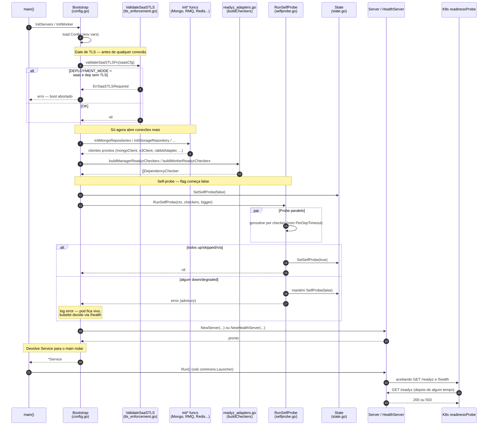
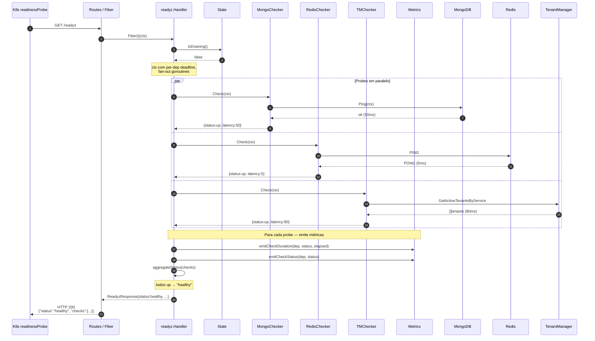
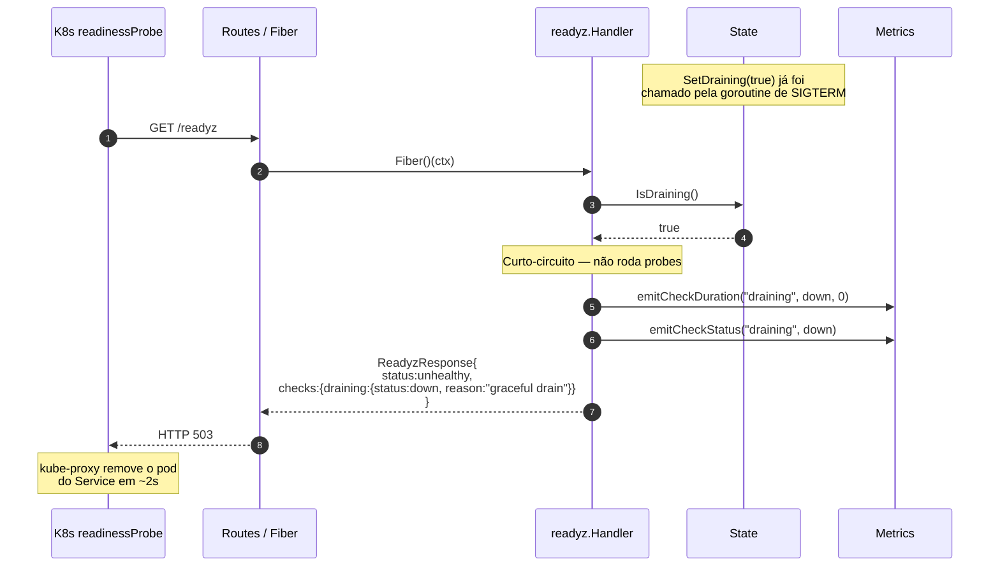
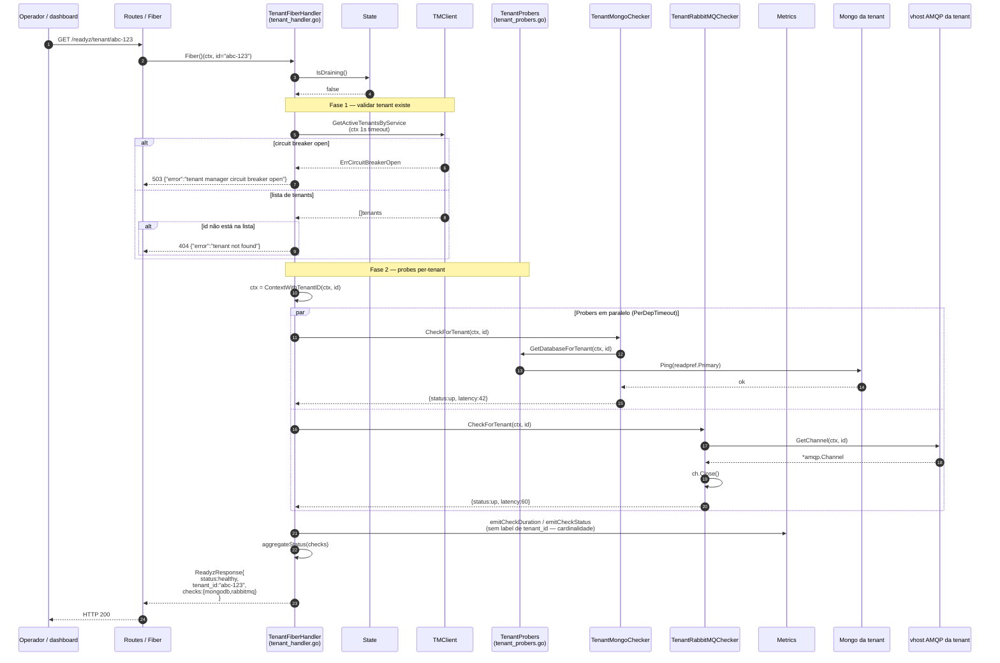
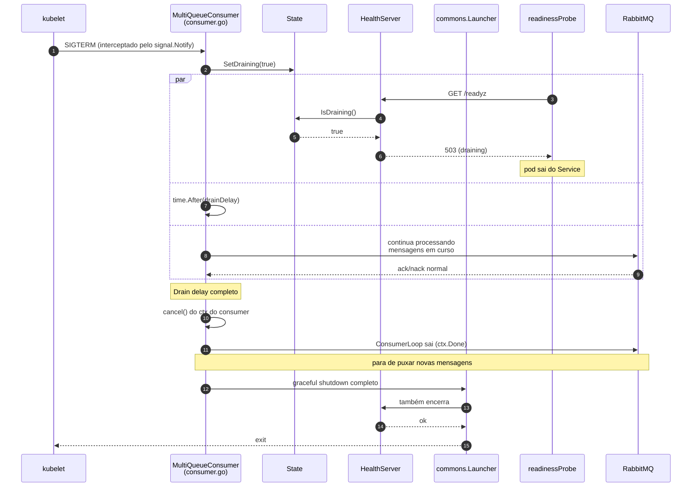

# Diagramas de sequência — `/readyz`

Cinco diagramas Mermaid cobrindo os fluxos principais de funcionamento. Leia em ordem — cada um se apoia no contexto do anterior.

> Os diagramas usam apenas atores de alto nível para ficarem legíveis. Detalhes de chamadas internas (locks, atomic loads, struct field reads) ficam de fora.

---

## Como ler

Os atores que aparecem repetidamente:

| Ator | Onde mora | Papel |
|---|---|---|
| `K8s` | kubelet / kube-proxy | Faz probes e roteia tráfego. |
| `Bootstrap` | `components/{manager,worker}/internal/bootstrap/config.go` | Orquestra inicialização. |
| `Server` | `bootstrap/server.go` (manager) ou `health_server.go` (worker) | Servidor HTTP Fiber. |
| `Routes` | `routes.go` (manager) ou montagem direta no health server (worker) | Roteador Fiber. |
| `Handler` | `pkg/bootstrap/readyz/handler.go` | Motor do `/readyz`. |
| `Checker` | `pkg/bootstrap/readyz/checker_*.go` | Probers individuais (Mongo, Redis, etc). |
| `Dep` | externa | MongoDB, RabbitMQ, Redis, S3, Tenant Manager. |
| `State` | `pkg/bootstrap/readyz/state.go` | Flags atomic (`drainingState`, `selfProbeOK`). |
| `Metrics` | `pkg/bootstrap/readyz/metrics.go` | Coletores Prometheus. |

---

## Diagrama 1 — Bootstrap (boot do pod)

Mostra a sequência completa do startup: do momento em que o `main` é chamado até o servidor estar aceitando requests. As caixas em multi-cor representam os pontos onde diferentes arquivos contribuem.



**Pontos-chave:**

- O TLS gate está **antes** das `init*`. Se Mongo plaintext em SaaS mode, conexões nunca abrem.
- Self-probe **não** crasha em falha. Pod fica vivo para `/health` servir 503.
- Worker e manager seguem o mesmo padrão — só mudam os `init*` chamados.

---

## Diagrama 2 — `GET /readyz` no caminho feliz

A request normal: pod está saudável, todos os deps respondem rápido. Foco no fan-out paralelo.



**Pontos-chave:**

- Probes rodam **em paralelo**. Tempo total ≈ tempo do checker mais lento, não a soma.
- `aggregateStatus` é a regra única: qualquer `down`/`degraded` derruba para `unhealthy` (HTTP 503). Status `up`, `skipped` e `n/a` contam como saudáveis.
- Métricas são emitidas **incondicionalmente** por probe — fundamental para `rate()` queries no Prometheus funcionarem.

---

## Diagrama 3 — `GET /readyz` durante drain

O pod já recebeu SIGTERM. O handler short-circuita: nem chega a chamar os checkers.



**Pontos-chave:**

- `IsDraining()` é leitura de `atomic.Bool`. Custo desprezível, seguro para hot path.
- Métricas continuam sendo emitidas com dep `"draining"` — dashboards conseguem rastrear rolling deploys.
- Resposta tem shape idêntico ao modo normal, só com um único check sintético `"draining"`.

---

## Diagrama 4 — `GET /readyz/tenant/:id`

O endpoint per-tenant. Tem duas fases: validação da tenant + probes per-tenant.



**Pontos-chave:**

- **Fase 1 (validação)** tem timeout próprio de 1s, igual ao `PerDepTimeout("tenant_manager")`.
- **Fase 2 (probes)** usa o mesmo padrão paralelo do `/readyz` global.
- Resposta carrega `tenant_id` extra. Métricas **não** ganham label de tenant_id — protege cardinalidade do Prometheus.
- Probe de Rabbit abre channel **e fecha imediatamente** — só prova conectividade, não segura recurso.

---

## Diagrama 5 — Drain completo (SIGTERM)

A sequência mais delicada: como o pod sai limpo do tráfego sem dropar request. Mostro o caminho do **manager**; worker é análogo (substitua `Server.drainLoop` por `MultiQueueConsumer.Run`'s SIGTERM goroutine, e `ServerManager` por `commons.Launcher`).

```mermaid
sequenceDiagram
    autonumber
    participant Kubelet as kubelet
    participant Pod as Process (Go)
    participant DrainLoop as drainLoop<br/>(server.go)
    participant State as State
    participant SrvMgr as ServerManager<br/>(lib-commons)
    participant Hooks as Shutdown hooks
    participant Handler as readyz.Handler
    participant K8sProxy as kube-proxy
    participant K8sProbe as readinessProbe (k8s)
    participant InFlight as Request em curso

    Note over Kubelet,Pod: Pod marcado para terminar
    Kubelet->>Pod: SIGTERM

    Pod->>DrainLoop: <-sigs (goroutine bloqueada acorda)
    DrainLoop->>State: SetDraining(true)
    Note over State: drainingState atomic = true

    par Próximas requests
        K8sProbe->>Handler: GET /readyz
        Handler->>State: IsDraining()
        State-->>Handler: true
        Handler-->>K8sProbe: HTTP 503 (draining)
        K8sProbe->>K8sProxy: pod não-ready
        K8sProxy->>K8sProxy: remove pod do Service<br/>(em ~1-2s)
    and Drain delay
        DrainLoop->>DrainLoop: time.After(drainDelay = 12s)
    and Requests em curso
        InFlight->>Handler: continua sendo processada
        Note over InFlight: request termina normalmente
    end

    Note over DrainLoop: 12s passaram

    DrainLoop->>SrvMgr: close(shutdownCh)

    Note over SrvMgr: Agora SrvMgr começa shutdown real
    SrvMgr->>SrvMgr: fecha listener HTTP
    Note over SrvMgr: novas conexões rejeitadas;<br/>conexões abertas finalizam graceful

    SrvMgr->>Hooks: invoca shutdown hooks
    Hooks->>Hooks: licenseShutdown.Terminate()
    Hooks->>Hooks: rdb.Close() (readyzRedisClient)
    Hooks->>Hooks: tmMongoManager.Close()

    SrvMgr-->>Pod: shutdown complete
    Pod-->>Kubelet: exit code 0
```

**Pontos-chave (esta é a sequência mais importante para entender):**

- **Por que `SetDraining(true)` antes de fechar o listener?** Porque entre o flag virar e o k8s remover do Service passam ~1-2s. Se o listener já estivesse fechado, novas conexões nesse intervalo dariam connection refused.
- **Por que dormir 12s?** É o sync window padrão do kube-proxy. Damos tempo para a remoção do Service propagar a todos os nós antes de fechar listeners.
- **Quem dispara o `close(shutdownCh)`?** O `drainLoop` controla, **não** o `ServerManager`. O ServerManager bloqueia esperando esse channel via `WithShutdownChannel`. Esse é o truque que dá ao manager controle sobre a ordem.
- **Hooks rodam por último.** Liberar Redis dedicado, license, etc. — só depois do listener fechado para garantir que nada ainda dependia desses recursos.

### Versão worker do drain

A diferença do worker é que **o consumer também participa**:



A diferença chave: **o cancel do ctx só vem depois do drain delay**. Se viesse antes, mensagens em curso seriam abortadas.

---

## Apêndice — Fluxos resumidos lado a lado

| Cenário | Quem flipa estado | Quem responde HTTP | Quem fecha recursos |
|---|---|---|---|
| Boot OK | `RunSelfProbe` flipa `selfProbeOK=true` | Server aceita requests | — |
| Boot com dep down | `selfProbeOK` fica `false` | `/health` 503 indefinido | — |
| `/readyz` saudável | nenhum | `Handler` agrega → 200 | — |
| `/readyz` com dep down | nenhum | `Handler` agrega → 503 | — |
| Drain (manager) | `drainLoop` flipa `drainingState=true` | `Handler` curto-circuita → 503 | shutdown hooks após 12s |
| Drain (worker) | goroutine SIGTERM em `consumer.go` flipa | `Handler` no `HealthServer` curto-circuita | consumer cancela após 12s |
| `/readyz/tenant/:id` ok | nenhum | `TenantFiberHandler` (2 fases) → 200 | — |
| `/readyz/tenant/:id` tenant inexistente | nenhum | retorno antes da fase 2 → 404 | — |

---

## Para fixar

Tente desenhar mentalmente o que acontece nestes cenários (ou rode o código com prints adicionados):

1. SIGTERM chega no manager **enquanto** uma request `/readyz` já está executando. O que acontece com essa request? (resposta: continua até o fim — só requests que **chegarem depois** veem `IsDraining()=true`.)

2. MongoDB cai durante 5 segundos. O `/readyz` reporta `down` em quanto tempo? (resposta: até 2s — o `PerDepTimeout("mongodb")`.)

3. Você reinicia o Tenant Manager. O circuit breaker do `tmclient` abre. O que o `/readyz` da fetcher mostra para o checker `tenant_manager`? (resposta: `{status:down, breaker_state:"open", error:"circuit breaker open"}`.)

4. O `selfProbeOK` está `false` mas todos os deps estão saudáveis no momento. Qual o status de `/health` e `/readyz`? (resposta: `/health` = 503 — não saiu do estado inicial. `/readyz` = 200 — não depende do self-probe.)

Esses cenários ajudam a internalizar a separação entre liveness (`/health`), readiness (`/readyz`) e drain — três conceitos que parecem o mesmo mas servem propósitos distintos.
