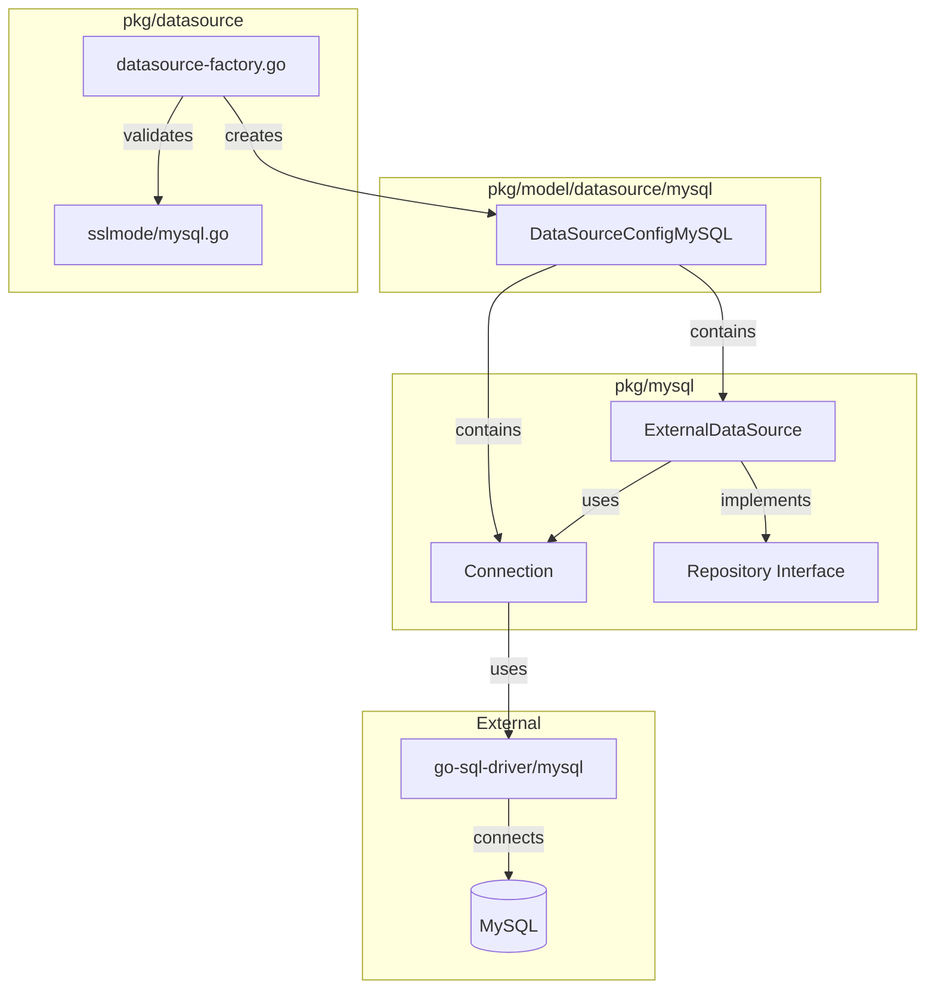
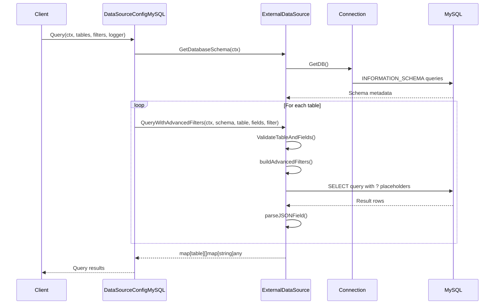
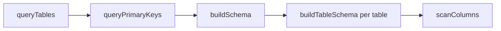
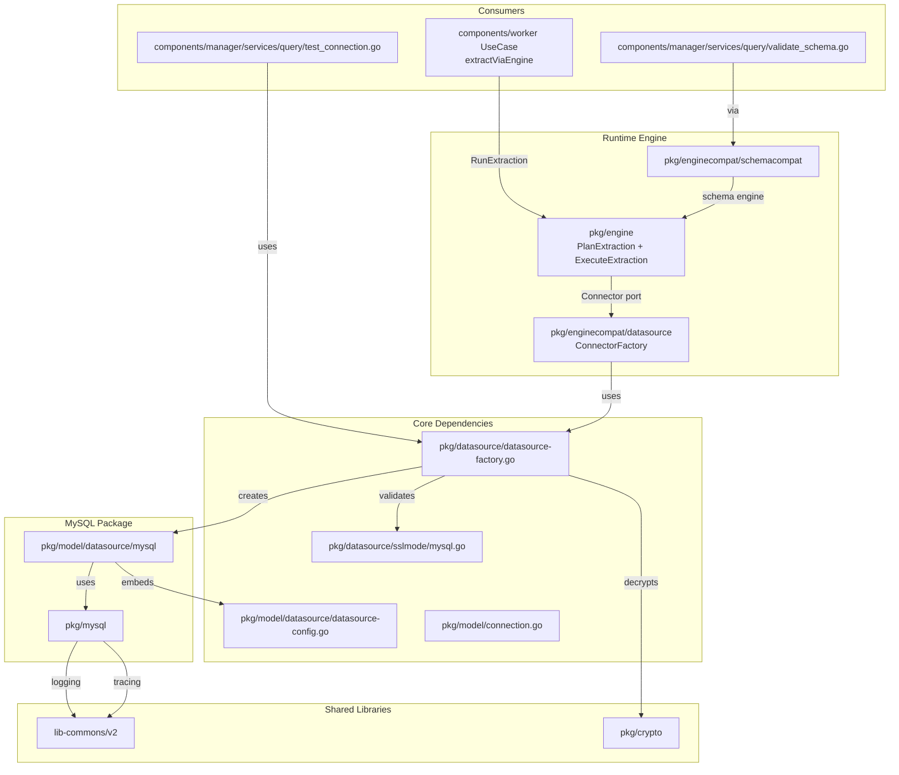

# MySQL Datasource

MySQL datasource implementation for the Fetcher service, providing data extraction and schema discovery capabilities.

## Overview

### Purpose
This datasource enables connection, querying, and schema discovery for MySQL databases. It implements the `DataSource` interface and provides advanced filtering, field validation, and automatic JSON field parsing.

### Supported Versions
- MySQL 5.7+
- MySQL 8.0+
- MariaDB 10.3+
- Amazon Aurora MySQL
- Google Cloud SQL for MySQL

### External Dependencies
| Dependency | Version | Purpose |
|------------|---------|---------|
| `github.com/go-sql-driver/mysql` | v1.9.3 | MySQL driver |
| `github.com/Masterminds/squirrel` | v1.5.4 | SQL query builder |

## Architecture

### Component Diagram



### Data Flow



### Design Patterns
- **Factory Pattern**: `NewDataSourceFromConnection()` creates configured datasources
- **Repository Pattern**: `ExternalDataSource` abstracts database operations
- **Interface Segregation**: `Repository` interface defines minimal contract
- **Embedding**: `DataSourceConfigMySQL` embeds base `DataSourceConfig`

## Components

### Connection

**Location:** `pkg/mysql/mysql.go`

**Responsibility:** Manages MySQL database connections with connection pooling.

```go
type Connection struct {
    ConnectionString   string     // DSN format for MySQL driver
    DBName             string     // Database name
    ConnectionDB       *sql.DB    // Connection pool
    Connected          bool       // Connection state
    Logger             log.Logger
    MaxOpenConnections int        // Default: 25
    MaxIdleConnections int        // Default: 10
}
```

#### Methods

| Method | Parameters | Returns | Description |
|--------|------------|---------|-------------|
| `Connect()` | - | `error` | Opens connection, pings DB, configures pool |
| `GetDB()` | - | `(*sql.DB, error)` | Lazy-loads connection if nil |

**Connection Pool Settings:**
- `MaxOpenConns`: 25
- `MaxIdleConns`: 10
- `MaxLifetime`: 5 minutes
- `MaxIdleTime`: 1 minute

### Datasource Interface

**Location:** `pkg/mysql/datasource.mysql.go`

```go
type Datasource interface {
    Query(ctx context.Context, schema []TableSchema, table string,
          fields []string, filter map[string][]any) ([]map[string]any, error)
    QueryWithAdvancedFilters(ctx context.Context, schema []TableSchema, table string,
                            fields []string, filter map[string]job.FilterCondition) ([]map[string]any, error)
    GetDatabaseSchema(ctx context.Context) ([]TableSchema, error)
    CloseConnection() error
}
```

### ExternalDataSource

**Location:** `pkg/mysql/datasource.mysql.go`

**Responsibility:** Implements `Datasource` interface for query execution and schema discovery.

#### Query()

**Parameters:**
- `ctx context.Context` - Request context with tracing
- `schema []TableSchema` - Pre-fetched schema for validation
- `table string` - Target table name
- `fields []string` - Columns to select (`["*"]` for all)
- `filter map[string][]any` - Simple IN-clause filters

**Behavior:**
1. Validates table and fields against schema
2. Builds parameterized SELECT with squirrel (`?` placeholders)
3. Executes with 10-second timeout
4. Parses JSON fields automatically

**Example:**
```go
results, err := repo.Query(ctx, schema, "users",
    []string{"id", "name", "metadata"},
    map[string][]any{"status": {"active", "pending"}})
// SELECT id, name, metadata FROM users WHERE status IN (?, ?)
```

#### QueryWithAdvancedFilters()

**Parameters:**
- Same as `Query()` but with `filter map[string]job.FilterCondition`

**Supported Operators:**

| Operator | Field | Example | SQL Generated |
|----------|-------|---------|---------------|
| `eq` | `Equals` | `[1, 2]` | `WHERE id IN (?, ?)` |
| `gt` | `GreaterThan` | `[100]` | `WHERE amount > ?` |
| `gte` | `GreaterOrEqual` | `[100]` | `WHERE amount >= ?` |
| `lt` | `LessThan` | `[1000]` | `WHERE amount < ?` |
| `lte` | `LessOrEqual` | `[1000]` | `WHERE amount <= ?` |
| `between` | `Between` | `[100, 1000]` | `WHERE amount >= ? AND amount <= ?` |
| `in` | `In` | `["a", "b"]` | `WHERE status IN (?, ?)` |
| `nin` | `NotIn` | `["c"]` | `WHERE status NOT IN (?)` |
| `ne` | `NotEquals` | `["inactive"]` | `WHERE status != ?` |
| `like` | `Like` | `["%active%"]` | `WHERE name LIKE ?` |

**Special Behaviors:**
- **Date fields**: End date adjusted to `T23:59:59.999Z` for `between` operator
- **UUID fields**: Validates UUID format for fields containing "id", "uuid", etc.
- **Timeout**: 15 seconds (vs 10 for simple queries)

#### GetDatabaseSchema()

**Parameters:**
- `ctx context.Context` - Request context

**Returns:** `[]TableSchema` with tables, columns, types, nullable flags, and primary keys

**Schema Discovery Process:**



**SQL Queries Used:**
```sql
-- Tables
SELECT table_name FROM information_schema.tables
WHERE table_schema = DATABASE() AND table_type = 'BASE TABLE'

-- Primary Keys
SELECT tc.table_name, kc.column_name
FROM information_schema.table_constraints tc
JOIN information_schema.key_column_usage kc ...
WHERE tc.constraint_type = 'PRIMARY KEY'
  AND tc.table_schema = DATABASE()

-- Columns
SELECT column_name, data_type,
       CASE WHEN is_nullable = 'YES' THEN true ELSE false END
FROM information_schema.columns
WHERE table_schema = DATABASE() AND table_name = ?
```

### DataSourceConfigMySQL

**Location:** `pkg/model/datasource/mysql/datasource-config.go`

**Responsibility:** High-level datasource wrapper implementing `DataSource` interface.

```go
type DataSourceConfigMySQL struct {
    datasource.DataSourceConfig           // Base config (ID, Host, Port, etc.)
    MySQLConnection *mysql.Connection
    MySQLRepository mysql.Repository
}
```

#### Methods

| Method | Description |
|--------|-------------|
| `GetConfig()` | Returns embedded base configuration |
| `GetType()` | Returns database type string |
| `Connect(ctx, logger)` | Sets status to available (connection pre-established) |
| `Close(ctx)` | Closes repository connection |
| `Query(ctx, tables, filters, logger)` | Multi-table query orchestration |
| `GetSchemaInfo(ctx, schemas)` | Returns `*model.DataSourceSchema` |

## Integrations and Dependencies

### Dependency Diagram



### Interfaces Implemented
- `datasource.DataSource` - Core datasource interface
- `mysql.Repository` - MySQL-specific repository interface

### Packages That Depend on This Datasource
| Package | File | Usage |
|---------|------|-------|
| `pkg/engine` (via `pkg/enginecompat/datasource`) | `adapter.go` | Generic data extraction jobs (worker `UseCase.extractViaEngine` → `EngineRunner.RunExtraction` → engine `Connector` port → factory) |
| `components/manager` | `test_connection.go:113` | Connection testing |
| `components/manager` (via `pkg/enginecompat/schemacompat`) | `validate_schema.go:198` | Schema validation / discovery |

## Error Handling

### Custom Error Types

Errors use the standardized `FET-XXXX` code format:

| Code | Constant | Description |
|------|----------|-------------|
| `FET-0413` | `ErrInvalidSSLMode` | Invalid SSL mode value |
| `FET-1040` | `ErrConnectionDown` | Database connection failed |
| `FET-1060` | `ErrSchemaValidationFailed` | Schema validation error |

### Error Wrapping Pattern

```go
// Connection errors
return nil, fmt.Errorf("failed to establish MySQL connection: %w", err)

// Query errors
return nil, fmt.Errorf("error executing query: %w", err)

// Timeout detection
if queryCtx.Err() == context.DeadlineExceeded {
    return nil, fmt.Errorf("query execution timeout after %v: %w", timeout, err)
}
```

### Retry Strategy
- **No built-in retry**: Relies on connection pooling for resilience
- **Connection pool**: Automatically manages connection lifecycle
- **Caller responsibility**: Services implement retry logic as needed

### Logging and Observability

**Log Levels:**
- `INFO`: Connection status, query execution starts
- `DEBUG`: SQL generation, connection strings (password masked)
- `ERROR`: Connection failures, query errors
- `WARN`: JSON parsing failures

**OpenTelemetry Spans:**

| Span Name | Attributes |
|-----------|------------|
| `mysql.data_source.query` | `request_id`, `repository_filter` |
| `mysql.data_source.query_with_advanced_filters` | `request_id`, `repository_filter` |
| `mysql.data_source.validate_table_and_fields` | `request_id` |
| `mysql.data_source.get_database_schema` | `request_id` |
| `datasource.mysql.get_schema_info` | `config_name`, `type`, `tables_count` |

## Usage Examples

### Basic CRUD Operations

#### Simple Query

```go
// Create datasource via factory
ds, err := datasource.NewDataSourceFromConnection(ctx, conn, cryptor, logger)
if err != nil {
    return err
}
defer ds.Close(ctx)

// Query with simple filter
results, err := ds.Query(ctx,
    map[string][]string{
        "users": {"id", "name", "email"},
    },
    map[string]map[string]job.FilterCondition{
        "mysql": {
            "users": {
                Equals: []any{"active"},
            },
        },
    },
    logger,
)
```

#### Advanced Filtering

```go
// Date range query with multiple conditions
results, err := ds.Query(ctx,
    map[string][]string{
        "orders": {"id", "customer_id", "total", "created_at"},
    },
    map[string]map[string]job.FilterCondition{
        "mysql": {
            "orders": {
                Between: []any{"2024-01-01", "2024-12-31"},  // Auto-adjusted end date
                GreaterThan: []any{100.00},
            },
        },
    },
    logger,
)
```

### Schema Discovery

```go
// Get schema for current database
schema, err := ds.GetSchemaInfo(ctx, nil) // MySQL uses DATABASE() context
if err != nil {
    return err
}

for _, table := range schema.Tables {
    fmt.Printf("Table: %s, Columns: %v\n", table.Name, table.Columns)
}
```

### Connection Testing

```go
// Direct connection test (used by test_connection service)
conn := &mysql.Connection{
    ConnectionString: "user:password@tcp(localhost:3306)/mydb?tls=false",
    Logger:           logger,
}

if err := conn.Connect(); err != nil {
    return fmt.Errorf("connection test failed: %w", err)
}
defer conn.ConnectionDB.Close()
```

## Connection String Format

```
[username[:password]@][protocol[(address)]]/dbname[?param1=value1&...]
```

**Examples:**
```go
// Standard TCP connection
"user:pass@tcp(localhost:3306)/mydb"

// With SSL/TLS
"user:pass@tcp(localhost:3306)/mydb?tls=true"

// With timezone
"user:pass@tcp(localhost:3306)/mydb?parseTime=true&loc=UTC"

// Unix socket
"user:pass@unix(/var/run/mysqld/mysqld.sock)/mydb"
```

**Components:**
| Component | Description | Example |
|-----------|-------------|---------|
| `username` | Database user | `myuser` |
| `password` | Plain password | `mypassword` |
| `protocol` | Connection protocol | `tcp`, `unix` |
| `address` | Server address | `localhost:3306` |
| `dbname` | Target database | `mydb` |
| `params` | Connection parameters | `tls=true` |

**SSL/TLS Modes:**
| Mode | Description |
|------|-------------|
| `false` | No TLS (default) |
| `true` | TLS enabled |
| `skip-verify` | TLS without certificate verification |
| `preferred` | TLS if available, otherwise plain |

**Note:** Custom TLS configs via `RegisterTLSConfig()` are not supported.

## Query Timeouts

| Operation | Timeout | Constant |
|-----------|---------|----------|
| Simple queries | 10 seconds | `QueryTimeoutMedium` |
| Advanced filter queries | 15 seconds | `QueryTimeoutSlow` |
| Schema discovery | 30 seconds | `SchemaDiscoveryTimeout` |
| Connection establishment | 5 seconds | `ConnectionTimeout` |

## JSON Field Handling

MySQL JSON columns are automatically parsed:

```go
// MySQL table with JSON column
result, err := repo.Query(ctx, schema, "products", []string{"id", "metadata"}, nil)

// Input from MySQL: {"metadata": []uint8(`{"color":"red","size":"large"}`)}
// Parsed result:    {"metadata": map[string]any{"color": "red", "size": "large"}}
```

**Parsing Order:**
1. Try unmarshal as `map[string]any` (JSON object)
2. Try unmarshal as `[]any` (JSON array)
3. Try unmarshal as `string` (JSON string literal)
4. Return raw bytes with warning log if all fail

## Key Characteristics

| Aspect | Detail |
|--------|--------|
| **Schema handling** | No schema prefix; uses `DATABASE()` context |
| **Field validation** | Strict - invalid fields cause errors |
| **Filter combination** | Multiple filters: OR within field, AND between fields |
| **JSON support** | Automatic parsing of MySQL JSON type |
| **NULL handling** | Preserved in results as nil |
| **Case sensitivity** | Case-insensitive column matching |
| **Wildcard support** | `"*"` expands to all columns |
| **Transaction support** | None - read-only queries |
| **Prepared statements** | Via squirrel parameterized queries |
